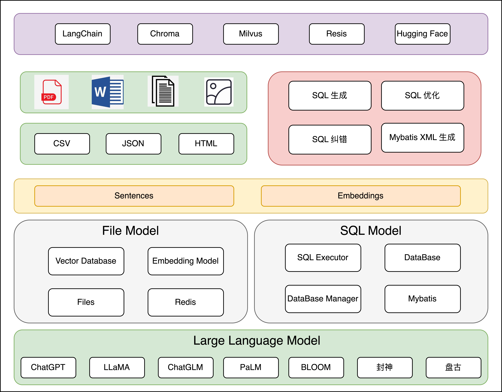

<p align="center">
<a href="https://github.com/CL-lau/SQL-GPT">


[//]: # (<center><span style="font-family: Arial; font-size: 30px;">SQL-GPT</span></center>)
</a>
</p>

<p align="center">
    <b>Tools for interacting with SQL and files are implemented through LLMs.</b>. <br />
    The most complete access interface is encapsulated
</p>

<p align="center">

[//]: # (  <a href="https://discord.gg/MMeYNTmh3x" target="_blank">)
[//]: # (      )
[//]: # (  </a> |)
[//]: # (  <a href="https://github.com/chroma-core/chroma/blob/master/LICENSE" target="_blank">)
[//]: # (      )
[//]: # (  </a> |)
  <a href="https://github.com/CL-lau/SQL-GPT/blob/main/README-zh.md" target="_blank">
      中文文档
  </a> |
  <a href="https://github.com/CL-lau/SQL-GPT/blob/main/README.md" target="_blank">
      英文文档
  </a>
</p>

## 简介

SQLGPT 是一款强大的工具，它能够通过简单的文字描述，自动生成符合要求的 SQL 查询语句。无论您是在快速生成复杂查询还是与数据库进行交互，SQL_GPT 都能够显著提升您的效率和工作流程。

## 功能列表

- [x] **自动生成 SQL 查询：** 只需简单的文字描述，工具将自动生成符合要求的 SQL 查询语句。
- [x] **错误修正建议：** 在查询存在错误时，工具会提供智能的修正建议，助您快速解决问题。
- [x] **数据库连接管理：** 轻松配置和管理多个数据库连接，直接在工具内执行生成的 SQL 查询。
- [x] **多数据库兼容：** 工具兼容多种主流数据库系统，适用于不同项目的需求。
- [x] **代理访问支持：** 针对特定场景，您可以通过系统代理来访问 GPT 服务。
- [x] **多 API KEY 轮询：** 您可以设置多个备选 ```API KEY``` 来访问 GPT，提升稳定性。
- [x] **SQL语句优化：** 通过GPT的能力根据数据库的结构进行SQL语句优化。
- [x] **Java持久层SQL语句生成：** 结合SQL以及数据库结构信息来自动生成Java持久层语句，如：```Mybatis```。
- [x] **多轮对话：** 通过多轮对话的方式来实现对生成SQL的不断优化。
- [x] **对文件系统对话** 通过引入向量数据库来完成对文件系统信息的整理，完整和文件系统的对话。
- [x] **增加缓存操作来加速文件对话** 通过引入多种的redis结构体来完成对向量数据库的访问加速。平均提高30%的查找速度、
- [ ] **数据自动可视化分析：** 在通过数据库操作完数据之后，通过对数据进行分析来展示数据的基础信息。

## 快速开始指南

要开始使用 SQL_GPT，只需按照以下简单步骤进行操作：

1. **安装所需依赖：** 确保您的环境中已安装 Python 3.x，并执行以下命令安装所需依赖包：

    ```bash
    pip install requirements.txt
    ```
2. **配置OPENAI数据：** 在 ```config.json```中配置您的```OPENAI-KEY```以及```BASE_URL```信息来方便同Chat交互，还可以通过```OPENAI-KEYS```列表来设置多个APP_KEY。

3. **配置数据库连接：** 在 ```config.json```中配置您的数据库连接信息，包括主机名、用户名、密码等，以便进行数据库交互。

4. **生成 SQL 查询：** 在工具的用户界面中，用自然语言描述您的查询需求。SQL_GPT 将会智能地生成相应的 SQL 查询语句。例如：
   
   ```python
   from gpt.SQLGPT import SQL_GPT
   sql_GPT = SQL_GPT()
   
   # 生成sql语句
   sql_GPT.generateSQL("生成两个数据库表的关联查询操作。")
   
   # 对错误的SQL进行修改
   sql_GPT.SQL_ERROR_CHECK("SELECT * FROM tableA WHERE user_id IN (SELECT user_id FROM tableB LIMIT 1000);", "SQL执行失败: (1235, This version of MySQL doesn't yet support 'LIMIT & IN/ALL/ANY/SOME subquery'")
   ```
   
## 功能详情

### 系统方案
SQl-GPT是基于LLM构造的本地问答系统。可以根据需求生成sql语句，并在这个基础上对sql进行优化和纠错以及生成mybatis的xml文件。此外，还可以直接执行sql语句，同时设置多个监控的数据库。
在和数据库交互的基础上，同时实现了同文件系统进行交互，通过引入向量数据库来增加交互的上下文，并通过采用redis结构体对查询进行缓存以此来提高查询速度，同时支持多种向量模型。
<center><span style="font-family: Arial; font-size: 12px;">同本地数据库，文件系统进行交互以及问答</span></center>



### 前置依赖
- ```redis``` 安装redis数据库，建议通过docker进行安装。
```bash
   docker run --restart=always -p 6379:6379 --name redis-docker -d redis:7.0.12  --requirepass admin
```
- ``` api_key``` 在与线上LLm进行交互时，需要实现申请好对应的```api-key```。
- ```MySql``` 在本地安装```MySql```数据库，同样推荐使用docker进行安装。

### 引用的项目

该项目使用了以下项目。
- [FastChat](https://github.com/lm-sys/FastChat) 提供 chat 服务
- [vicuna-13b](https://huggingface.co/Tribbiani/vicuna-13b) 作为基础模型
- [langchain](https://github.com/hwchase17/langchain) 工具链
- [Auto-GPT](https://github.com/Significant-Gravitas/Auto-GPT) 通用的插件模版
- [Hugging Face](https://huggingface.co/) 大模型管理
- [Chroma](https://github.com/chroma-core/chroma) 向量存储
- [Milvus](https://milvus.io/) 分布式向量存储
- [ChatGLM](https://github.com/THUDM/ChatGLM-6B) 基础模型
- [llama-index](https://github.com/jerryjliu/llama_index) 基于现有知识库进行[In-Context Learning](https://arxiv.org/abs/2301.00234)来对其进行数据库相关知识的增强。

## Star历史


[](https://star-history.com/#CL-lau/SQL-GPT&Date)
